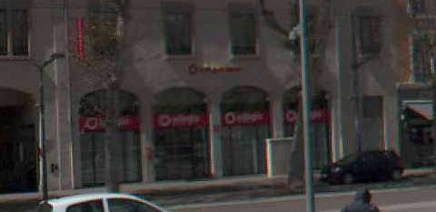
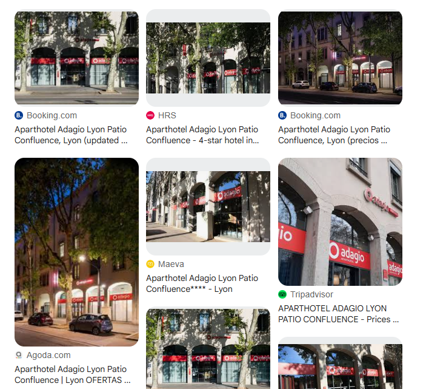

So yeah, we're clearly in some random place in France…

At first I tried searching for the church. But then I noticed this:



So I just threw it into Google Images.



And… bingo. Had the exact spot.

import LeafletMap from '../../components/LeafletMap.astro'


<LeafletMap lat={45.74504546759622} lon={4.823240241967142} popuptext={"Lyon, France"}/>

## Flag

```sh
THC{r3v3r53_534rch_7h15_bl4nd1n3}
```