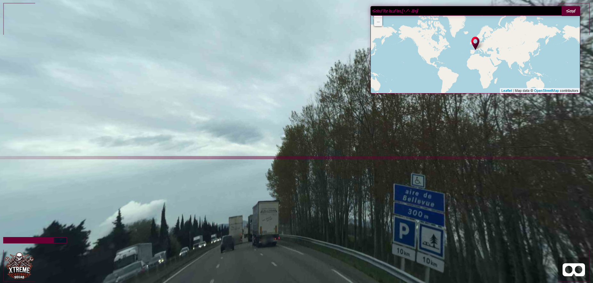
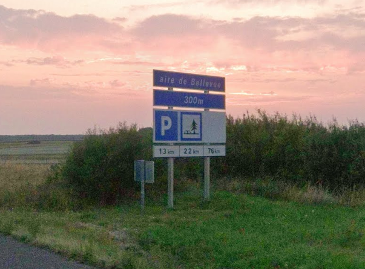

So yeah, we were clearly somewhere random in France…



So… I searched the place on Google Maps, but Google Maps completely baited me into wasting time on the wrong highway.



At first, I was convinced this was the correct spot. I thought maybe the area had changed over time, so I kept trying different positions and angles on Street View… but every single attempt was wrong.

After wasting way too much time fighting with the wrong location, I finally decided to search for another place with the same name instead.

And… bingo. I had the exact spot.


import LeafletMap from '../../components/LeafletMap.astro'

<LeafletMap lat={44.80423710147683} lon={4.850520774923295} popuptext={"N7"}/>

## Flag

```sh
THC{h16hw4y5_4r3_50_0h10}
```