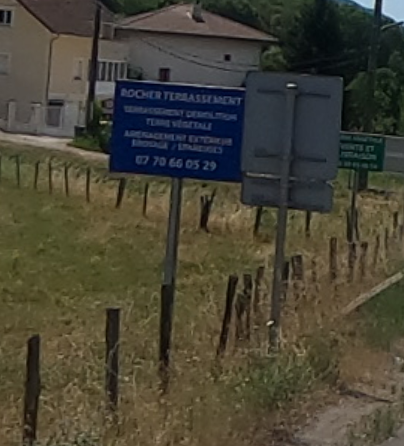
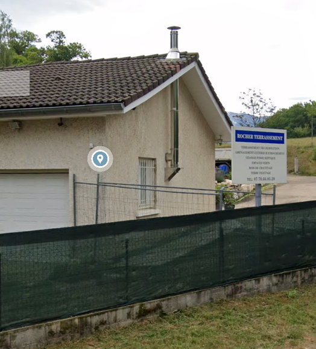

So yeah, we were clearly somewhere random in France…

So I looked at the sign and tried to read what it said.



Since I don’t speak French, I threw the image into Gemini and asked it to read it for me — it even searched the place automatically.

By cross-referencing the company name and phone number with public databases and French business registries (like *L'Annuaire des Entreprises*), it gave me the following intel:

### Target Intel

* **Company Name:** ROCHER TERRASSEMENT
* **Registered Address:** 165 CHEMIN DU MOLLARD ROND
* **City / Postal Code:** 38140 RENAGE, France
* **Department:** Isère (38), Rhône-Alpes region
* **Registration Number (SIREN/SIRET):** 821 140 662 / 821 140 662 00015

**165 Chemin du Mollard Rond, Renage**

On Google Maps, I found a matching sign.



After that, I just had to look for a highway matching the shape and width from the original image.

And… bingo. I had the exact spot.


import LeafletMap from '../../components/LeafletMap.astro'

<LeafletMap lat={45.347051974462154} lon={5.511033735238016} popuptext={"986 D1085"}/>

## Flag

```sh
THC{60774_61v3_cr3d17_70_7h3_516n}
```