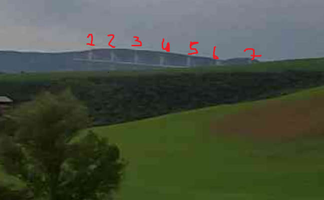
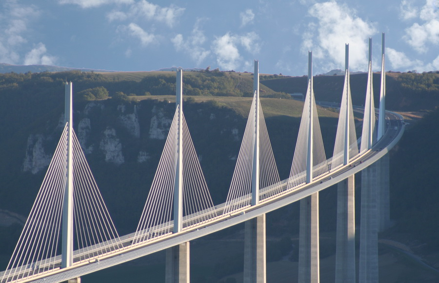
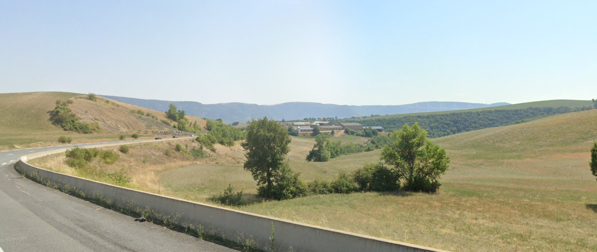

Off in the distance, I could see a huge bridge. That seemed like a good starting point.



It was clearly a cable-stayed bridge.

So I searched on Google for large cable-stayed bridges.

I ended up with two possible matches: the Viaduct of Millau (Viaduc de Millau) and the Normandy Bridge (Pont de Normandie).

After looking at the Viaduc de Millau, I noticed it had the same number of towers as the one in the image — 7 in total.



To figure out the viewing direction, I used the mountains on the left side as a reference point.

At that point, I already knew from which side the bridge was being viewed, so all that was left was checking Google Maps.

Since the area was really hilly, the bridge wasn’t visible from lower ground because the hills blocked the view. So I enabled the terrain layer in Google Maps to spot higher areas and started looking for a road with a curve matching the one in the 3D image, from the same viewing direction.

In Google Maps:



And… bingo. I had the exact spot.


import LeafletMap from '../../components/LeafletMap.astro'

<LeafletMap lat={44.12672967863505} lon={3.055864067172377} popuptext={"D911"}/>

## Flag

```sh
THC{much_4v3yr0n_v3ry_r1zz}
```