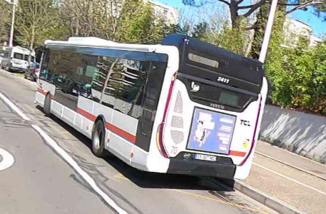
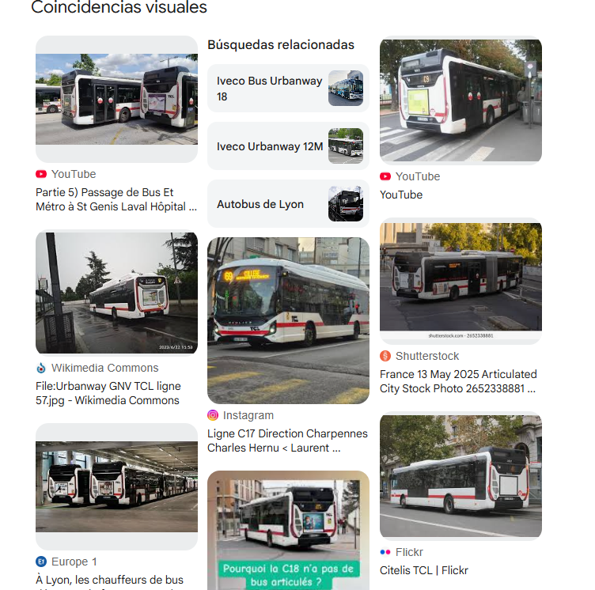
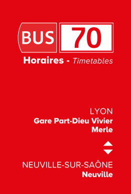
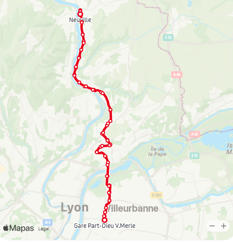
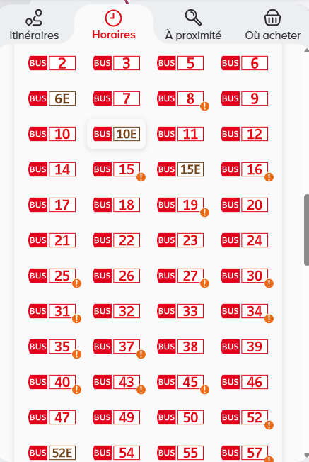
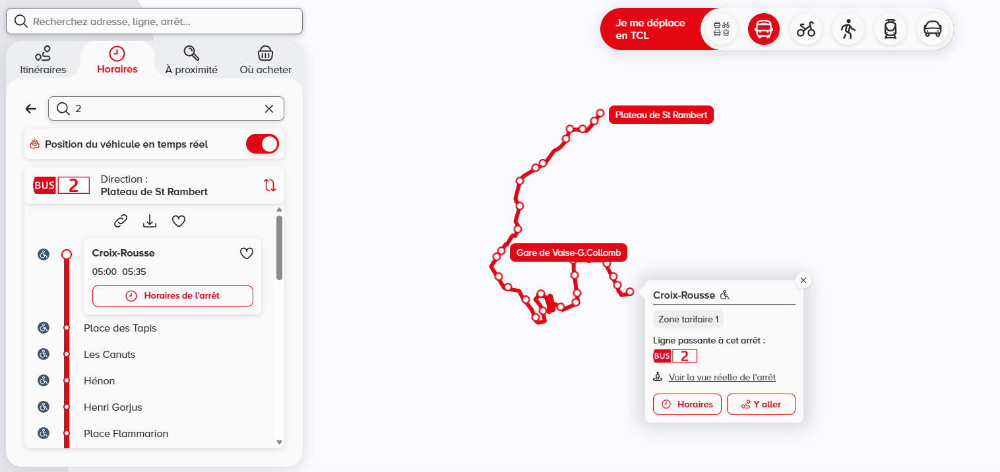
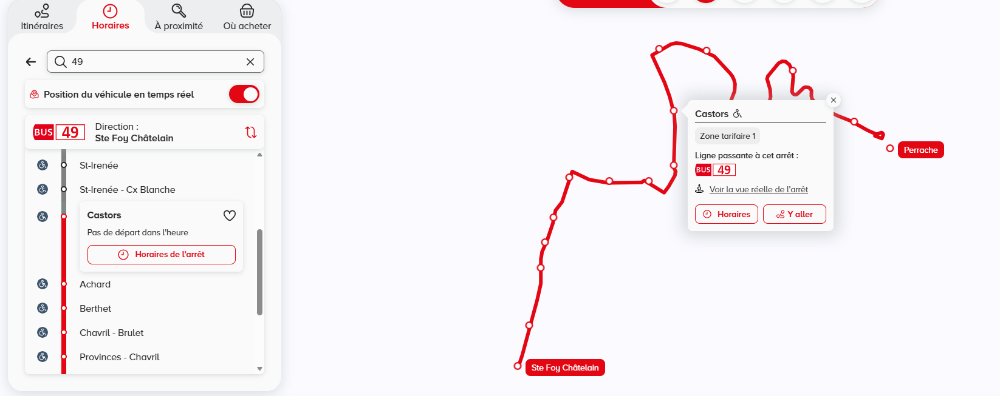
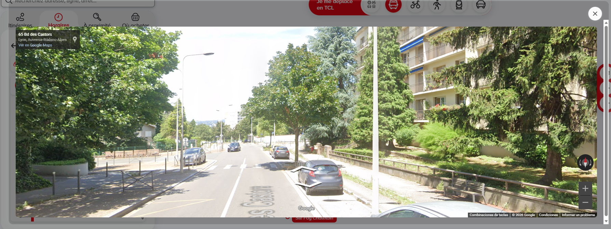
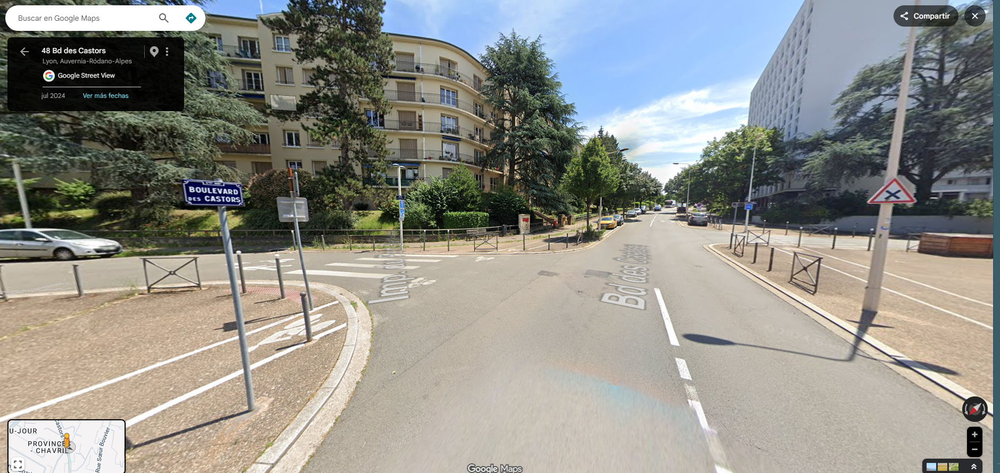

The very first thing I noticed was the bus.



So naturally, I went to Google to figure out where this bus was from.



Turns out it was an Iveco Bus Urbanway public transport bus operated by the TCL network in Lyon, France.

Then I noticed the number **70** and immediately thought: *that has to be the bus route.*



So I opened Google Maps on one side and the route page on the other. Then I manually followed the entire route on Google Maps, hoping I’d eventually spot the building from the image.

[TransitApp Route 70](https://transitapp.com/es/region/lyon/tcl/bus-70)



After going through the route once… and then a second time just to make sure I hadn’t missed anything… and wasting over an hour doing this… I finally realized:

This wasn’t the right route.

At that point, I spent another 30 minutes trying to search randomly based on the surrounding buildings, but Lyon is HUGE and everything started looking the same.

By then, it was already midnight. I wanted to sleep so badly, but I had mentally committed to finding the location before going to bed. No matter how long it took.

So I went to the main TCL website and started checking bus routes directly.

[TCL Routes Page](https://www.tcl.fr/se-deplacer/horaires)

I honestly don’t know if it was the sleep deprivation kicking in, but the only idea I had left was to basically brute-force the entire bus network manually.

I thought it wouldn’t take *that* long.

Spoiler: it took WAY longer than expected.

The only good thing was that I realized I could preview locations directly from the TCL website instead of opening every single thing in Google Maps manually, which at least saved me a little bit of time.

It also helped because if a previous route had already passed through an area, I instantly knew I didn’t need to check it again since I had already confirmed the location wasn’t there.

So… it was time to start checking every route one by one.



I started from route 2, since it was the first one listed, and kept going in order.



After around two more hours of staring at bus routes nonstop — with Linkin Park playing in the background like some kind of emotional support soundtrack — I finally reached route **49**, at the **Castors** station.






I moved around a little bit… and finally found the spot 😭😭

Thank God it wasn’t the last route.




import LeafletMap from '../../components/LeafletMap.astro'

<LeafletMap lat={45.752133471116956} lon={4.808774795383215} popuptext={"Corse"}/>

## Flag

```sh
THC{y0u_ju57_607_0v3rp4553d}
```