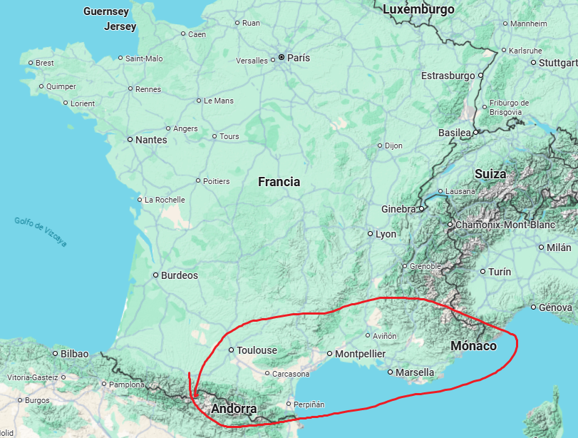
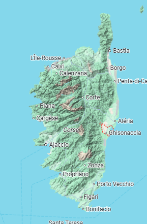
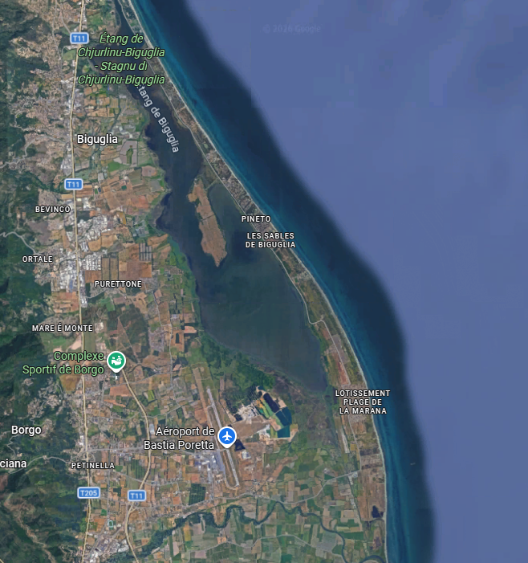

We were obviously somewhere on a beach in France…

Looking around, I could see mountains in the background, so it had to be a part of France with mountainous terrain. My first thought was to search Google Maps for coastal areas with mountains nearby.



So I started checking all over southern France for places matching the shape from the image. I couldn’t find a single location that was that long and also had water on both sides and a parking.

After searching for a while, I suddenly remembered that France also has islands…

So I started looking there instead.



I found this island, which had a lot of mountains. Now I just needed to find the exact spot. Logically, it had to be a narrow stretch of land with water on both sides.



This place matched all the requirements.

And… bingo. I had the exact spot.

import LeafletMap from '../../components/LeafletMap.astro'

<LeafletMap lat={42.64181981289185} lon={9.460087828338146} popuptext={"Corse"}/>

## Flag

```sh
THC{c0r51c4_bu7_7h3_w347h3r_l0w_k3y_5uck5}
```