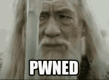

- **Dificultad:** *Medium*
- **Categoria:** *Reversing*
- **Herramientas:** *(Binary Ninja, ghidra, C++)*

### Descripción 

Un binario que pide unas palabras magicas, nuestra tarea es encontrar esas palabras desensamblando el codigo y entendiendo el desencriptado de las palabras magicas(La flag)

### Desensamblado del codigo

En ghidra veo primero la funcion main y cambio los nombres de las variables para entenderlo mejor

```c


undefined8 main(void)

{
  int comp;
  size_t last;
  char user_input [256];
  undefined8 key;
  undefined8 local_30;
  void *input_cp;
  int multiplo_8;
  int final_length;
  int interador;
  
  key = 0x636e655f796e6974;
  local_30 = 0x79656b5f74707972;
  puts("Try to open the chest!");
  printf("Maybe try saying the magic word: ");
  fgets(user_input,0x100,stdin);
  last = strcspn(user_input,"\n");
  user_input[last] = '\0';
  printf("input: %s\n",user_input);
  last = strlen(user_input);
  final_length = (int)last;
  multiplo_8 = final_length % 8;
  input_cp = malloc((long)(multiplo_8 + final_length));
  memcpy(input_cp,user_input,(long)final_length);
  memset((void *)((long)final_length + (long)input_cp),0,(long)multiplo_8);
  final_length = final_length + multiplo_8;
  step1(input_cp,final_length,&key);
  printf("result: 0x");
  for (interador = 0; interador < final_length; interador = interador + 1) {
    printf("%02X",(ulong)*(byte *)((long)input_cp + (long)interador));
  }
  putchar(10);
  if ((final_length == 34) && (comp = memcmp(input_cp,&DAT_00404080,0x22), comp == 0)) {
    puts("Congrats! Here\'s your treasure: ");
    puts("*******************************************************************************");
    puts("          |                   |                  |                     |");
    puts(" _________|________________.=\"\"_;=.______________|_____________________|_______");
    puts("|                   |  ,-\"_,=\"\"     `\"=.|                  |");
    puts("|___________________|__\"=._o`\"-._        `\"=.______________|___________________");
    puts("          |                `\"=._o`\"=._      _`\"=._                     |");
    puts(" _________|_____________________:=._o \"=._.\"_.-=\"\'\"=.__________________|_______");
    puts("|                   |    __.--\" , ; `\"=._o.\" ,-\"\"\"-._ \".   |");
    puts("|___________________|_._\"  ,. .` ` `` ,  `\"-._\"-._   \". \'__|___________________");
    puts("          |           |o`\"=._` , \"` `; .\". ,  \"-._\"-._; ;              |");
    puts(" _________|___________| ;`-.o`\"=._; .\" ` \'`.\"` . \"-._ /________________|_______");
    puts("|                   | |o;    `\"-.o`\"=._``  \'` \" ,__.--o;   |");
    puts("|___________________|_| ;     (#) `-.o `\"=.`_.--\"_o.-; ;___|___________________");
    puts("____/______/______/___|o;._    \"      `\".o|o_.--\"    ;o;____/______/______/____");
    puts("/______/______/______/_\"=._o--._        ; | ;        ; ;/______/______/______/_");
    puts("____/______/______/______/__\"=._o--._   ;o|o;     _._;o;____/______/______/____");
    puts("/______/______/______/______/____\"=._o._; | ;_.--\"o.--\"_/______/______/______/_");
    puts("____/______/______/______/______/_____\"=.o|o_.--\"\"___/______/______/______/____");
    puts("/______/______/______/______/______/______/______/______/______/______/________");
    puts("*******************************************************************************");
    free(input_cp);
    return 0;
  }
  puts("Hmmmm.... didn\'t open...");
  free(input_cp);
  return 0;
}


```
Noto que la flag debe tener un tamaño de *34* bytes y los bytes con lo que se compara despues de aplicarle la funcion de encriptado se encuentran en DAT_00404080

Bytes de binary ninja

```
00000000: 38 75 5b cb 44 d2 be 5d 96 9c 56 43 ea 98 06 75  8u[.D..]..VC...u
00000010: 4a 48 13 e6 d4 e8 8e 4f 72 70 8b ff dc 99 f8 76  JH.....Orp.....v
00000020: c5 c9                                            ..
```

En Binary Ninja veo esto que logicamente pienso que es la key de un cifrado que se hara en alguna funcion.

```c
00401347        __builtin_strncpy(dest: &key, src: "tiny_encrypt_key", count: 0x10)
```

En la función que llame *step1()* en ghidra lo que hace es dividir nuestro inputs en 8 partes (como nuestro length es de 34 si aplicamos 34 >> 2 es 8) y lo va a pasar por *Tea()* nombre que modifique para recordarmelo mejor (al principio ni sabia que era la encriptación **TEA**). Le pasa los bloques a esa funcion.

```c
void step1(long input,uint length,undefined8 key)

{
  undefined8 bloque_actual;
  uint i;
  
  for (i = 0; i < length >> 2; i = i + 1) {
    bloque_actual = *(undefined8 *)(input + (int)(i << 3));
    Tea(&bloque_actual,key);
    *(undefined8 *)((int)(i << 3) + input) = bloque_actual;
  }
  return;
}

```

#### Comprendiendo el algoritmo de cifrado

La primera vez que vi este algoritmo no entendia muy bien lo que hacia y era muy complicado, asi que busque en internet y le dije a deepseek que me ayudara a entender que tipo de algoritmo se esta usando en esta funcion y me dijo que era **TEA**.


```c
void Tea(uint *bloque,int *key)

{
  uint v2;
  uint v1;
  int i;
  int delta;
  
  v1 = *bloque;
  v2 = bloque[1];
  delta = 0;
  for (i = 0; i < 32; i = i + 1) {
    delta = delta + -0x61c88647;
    v1 = v1 + (v2 * 0x10 + *key ^ delta + v2 ^ key[1] + (v2 >> 5));
    v2 = v2 + (v1 * 0x10 + key[2] ^ delta + v1 ^ key[3] + (v1 >> 5));
  }
  *bloque = v1;
  bloque[1] = v2;
  return;
}

```

Segun [Tea-XTEA-tayloredge.com](https://tayloredge.com/reference/Mathematics/TEA-XTEA.pdf): 

> The Tiny Encryption Algorithm is one of the fastest and most efficient cryptographic algorithms in existence. It was developed by David Wheeler and Roger Needham at the Computer Laboratory of Cambridge University. It is a Feistel cipher which uses operations from mixed (orthogonal) algebraic groups - XOR, ADD and SHIFT in this case. This is a very clever way of providing Shannon's twin properties of diffusion and confusion which are necessary for a secure block cipher, without the explicit need for P-boxes and S-boxes respectively. It encrypts 64 data bits at a time using a 128-bit key. It seems highly resistant to differential cryptanalysis, and achieves complete diffusion (where a one bit difference in the plaintext will cause approximately 32 bit differences in the ciphertext) after only six rounds. Performance on a modern desktop computer or workstation is very impressive.

Si quieres leer mas te dejo los links de las webs que revise para resolver este reto.

[Tea-XTEA-tayloredge.com](https://tayloredge.com/reference/Mathematics/TEA-XTEA.pdf)

[Tiny Encryption Algorithm-Wikipedia](https://en.wikipedia.org/wiki/Tiny_Encryption_Algorithm)

Luego de leer el codigo y entender la forma de descencriptarlo solo era hacerlo yo mismo. Para ello use el mismo codigo de ghidra y lo modifique para que descencripte para ello me guie del codigo de la pagina de wikipedia del algoritmo.

### POC

```cpp

#include <bits/stdc++.h>

using namespace std;

void Tea(uint *bloque, uint *key)

{
    uint v2;
    uint v1;
    uint i;
    uint delta;

    v1 = *bloque;
    v2 = bloque[1];
    delta = 0x9E3779B9;
    uint suma = delta * 32;
    for (i = 0; i < 32; i = i + 1)
    {
        v2 = v2 - ((v1 * 0x10 + key[2]) ^ (v1 + suma) ^ (key[3] + (v1 >> 5)));
        v1 = v1 - ((v2 * 0x10 + *key) ^ (v2 + suma) ^ (key[1] + (v2 >> 5)));
        suma -= delta;
    }

    *bloque = v1;
    bloque[1] = v2;
    return;
}

int main()
{
    uint8_t flag_cifrada[34] =
        {
            0x38, 0x75, 0x5b, 0xcb, 0x44, 0xd2, 0xbe, 0x5d, 0x96, 0x9c, 0x56, 0x43, 0xea, 0x98, 0x06, 0x75,
            0x4a, 0x48, 0x13, 0xe6, 0xd4, 0xe8, 0x8e, 0x4f, 0x72, 0x70, 0x8b, 0xff, 0xdc, 0x99, 0xf8, 0x76,
            0xc5, 0xc9
        };

    uint key[4];
    const char *key_str = "tiny_encrypt_key";
    memcpy(key, key_str, 16);

    for (int i = 0; i < 34; i += 8)
    {
        uint *block = reinterpret_cast<uint *>(flag_cifrada + i);
        Tea(block, key);
    }

    for (int i = 0; i < 34; ++i)
    {
        if (flag_cifrada[i] == 0)
            break;
        cout << static_cast<char>(flag_cifrada[i]);
    }
}

```

#### Compilando y ejecución de nuestro poc

```sh
kali  RisecCTF  01:34  g++ treasure_solver.cpp -o treasure_solve                        
kali  RisecCTF  01:39  ./treasure_solve                         
RS{oh_its_a_TEAreasure_chest}   
```

#### Probando nuestra "palabras magicas"
```sh
kali  RisecCTF  00:15  /lib64/ld-linux-x86-64.so.2 ./treasure

Try to open the chest!
Maybe try saying the magic word: RS{oh_its_a_TEAreasure_chest}
input: RS{oh_its_a_TEAreasure_chest}
result: 0x38755BCB44D2BE5D969C5643EA9806754A4813E6D4E88E4F72708BFFDC99F876C5C9
Congrats! Here's your treasure: 

```

### Flag

```sh
RS{oh_its_a_TEAreasure_chest}   
```

