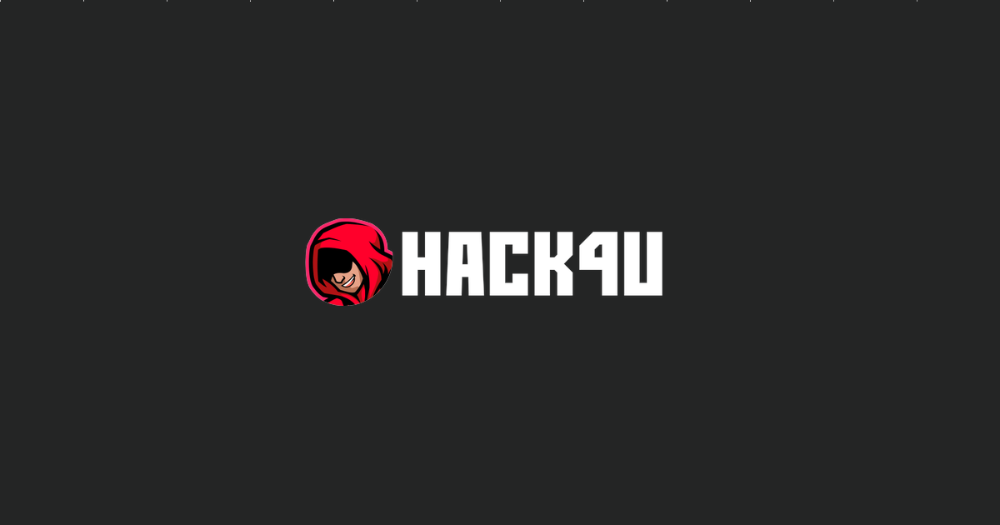
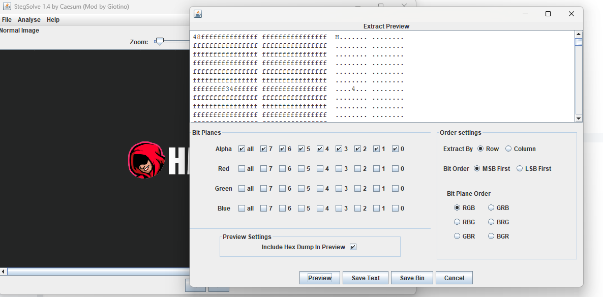
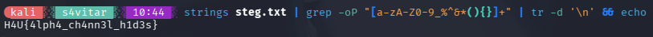

- **Dificultad:** *Difícil*
- **Categoría:** *Esteganografía*
- **Herramientas:** *(StegSolve, Python)*

### Descripción 

La descripción del reto dice exactamente lo que hay que hacer: ver el alpha de la imagen (la A de RGBA).

#### Vista general



#### Consiguiendo la flag

Como sabemos dónde buscar, simplemente hay que comenzar a buscar. Para ello, utilicé StegSolve, que me permite aplicar filtros de color e inspeccionar los planos de bits de la imagen.

Lo que hice para ver los alpha fue ir a *Analyse > Data Extract > Seleccionar all > Darle a preview*, y en el preview se puede ver la flag separada en el documento.



Entonces guardé el preview como texto en **steg.txt**, y luego, con este comando, obtuve la flag:

```bash
strings steg.txt | grep -oP "[a-zA-Z0-9_%^&*(){}]+" | tr -d '\n' && echo
````



### Flag

```sh
H4U{4lph4_ch4nn3l_h1d3s}
```
