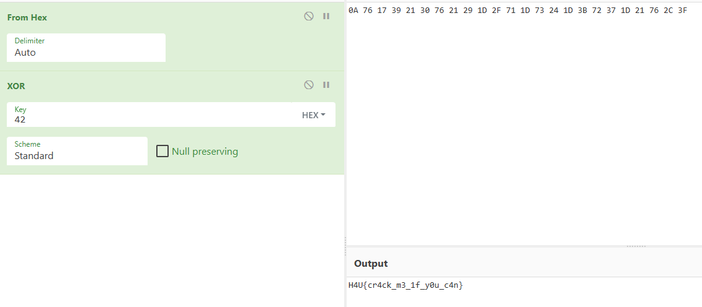

- **Dificultad:** *Medio*
- **Categoría:** *Reversing*
- **Herramientas:** *([cyberchef](https://cyberchef.io/), Ghidra)*

### Descripción 

El binario pide una contraseña que está codificada con XOR.

### Desensamblado del código

Al desensamblar el código, vemos una función que aplica un XOR; entonces aplicas el XOR y ya no había mucho que hacer 😑.

```c
void FUN_00101199(long param_1)

{
  byte local_28 [28];
  int i;
  
  local_28[0] = 10;
  local_28[1] = 0x76;
  local_28[2] = 0x17;
  local_28[3] = 0x39;
  local_28[4] = 0x21;
  local_28[5] = 0x30;
  local_28[6] = 0x76;
  local_28[7] = 0x21;
  local_28[8] = 0x29;
  local_28[9] = 0x1d;
  local_28[10] = 0x2f;
  local_28[0xb] = 0x71;
  local_28[0xc] = 0x1d;
  local_28[0xd] = 0x73;
  local_28[0xe] = 0x24;
  local_28[0xf] = 0x1d;
  local_28[0x10] = 0x3b;
  local_28[0x11] = 0x72;
  local_28[0x12] = 0x37;
  local_28[0x13] = 0x1d;
  local_28[0x14] = 0x21;
  local_28[0x15] = 0x76;
  local_28[0x16] = 0x2c;
  local_28[0x17] = 0x3f;
  for (i = 0; i < 0x18; i = i + 1) {
    *(byte *)(param_1 + i) = local_28[i] ^ 0x42;
  }
  *(undefined1 *)(param_1 + 0x18) = 0;
  return;
}
````

Yendo a [Cyberchef](https://cyberchef.io/#recipe=From_Hex%28'Auto'%29XOR%28%7B'option':'Hex','string':'42'%7D,'Standard',false%29&input=MEEgNzYgMTcgMzkgMjEgMzAgNzYgMjEgMjkgMUQgMkYgNzEgMUQgNzMgMjQgMUQgM0IgNzIgMzcgMUQgMjEgNzYgMkMgM0Y)



Los que crearon el reto no se esforzaron mucho; la flag.

### Flag

```sh
H4U{cr4ck_m3_1f_y0u_c4n}
```