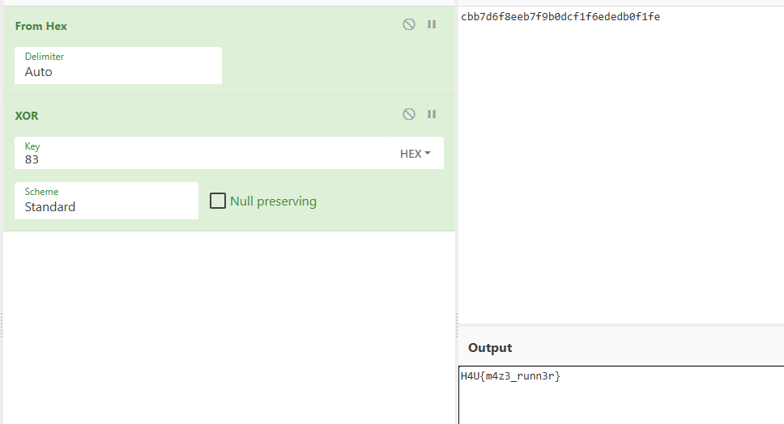

- **Dificultad:** *Medio*
- **Categoria:** *Reversing*
- **Herramientas:** *([cyberchef](https://cyberchef.io/), ghidra)*

### Descripción 

El binario pide una contraseña que esta codificada con XOR

### Desensamblado del codigo

Al desemsamblar el codigo vemos una funcion que aplica un XOR, entonces aplicas el xor y ya no habia mucho que hacer igual que en CrackMe

```c

void FUN_001012a4(void)

{
  byte local_48 [16];
  undefined1 local_38;
  byte local_28 [28];
  int local_c;
  
  local_28[0] = 0xcb;
  local_28[1] = 0xb7;
  local_28[2] = 0xd6;
  local_28[3] = 0xf8;
  local_28[4] = 0xee;
  local_28[5] = 0xb7;
  local_28[6] = 0xf9;
  local_28[7] = 0xb0;
  local_28[8] = 0xdc;
  local_28[9] = 0xf1;
  local_28[10] = 0xf6;
  local_28[0xb] = 0xed;
  local_28[0xc] = 0xed;
  local_28[0xd] = 0xb0;
  local_28[0xe] = 0xf1;
  local_28[0xf] = 0xfe;
  for (local_c = 0; local_c < 0x10; local_c = local_c + 1) {
    local_48[local_c] = local_28[local_c] ^ 0x83;
  }
  local_38 = 0;
  printf("You escaped the maze! Flag: %s\n",local_48);
  return;
}

```
Yendo a [Cyberchef](https://cyberchef.io/#recipe=From_Hex('Auto')XOR(%7B'option':'Hex','string':'83'%7D,'Standard',false)&input=Y2JiN2Q2ZjhlZWI3ZjliMGRjZjFmNmVkZWRiMGYxZmU)



Los que crearon el reto no se esforzaron mucho; la flag.

### Flag

```sh
H4U{m4z3_runn3r}
```