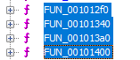
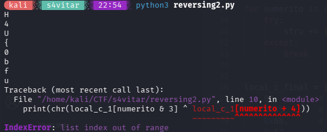

- **Dificultad:** *Difícil*
- **Categoría:** *Reversing*
- **Herramientas:** *(Ghidra, Python)*

### Descripción 

Binario con protección anti-debug, flag fragmentada en múltiples funciones con claves XOR rotativas. Solo los mejores lo resolverán.

### Desensamblado del código

```c
undefined8 FUN_001010c0(void)

{
  int key_clave;
  char *no_se;
  size_t l_char;
  char buffer [264];
  
  signal(5,FUN_001012a0);
  key_clave = FUN_001012b0();
  if (key_clave == 0) {
    puts("=== Obfuscated CrackMe v2.0 ===");
    puts("This binary is protected. Good luck.");
    printf("Enter the key: ");
    no_se = fgets(buffer,0x100,stdin);
    if (no_se != (char *)0x0) {
      l_char = strcspn(buffer,"\n");
      buffer[l_char] = '\0';
      key_clave = FUN_00101440(buffer);
      if (key_clave == 0) {
        no_se = "Access denied.\n";
        if (DAT_0010405c != 0) {
          no_se = "Debugger detected.\n";
        }
        printf(no_se);
        return 0;
      }
      printf("Impressive! Flag: %s\n",buffer);
      return 0;
    }
  }
  else {
    puts("Nice try, debugger detected!");
  }
  return 1;
}
````

El código tiene un antidebugger que vemos que se llama en la función *FUN_001012c0*; lo parcheé y, aun así, no pude lograr conseguir la key mediante debugging, por lo que procedí a tratar de entender el código para aplicar yo mismo la lógica.

En la función *FUN_001012b0* trato de leer el código, pero está muy enredado; no se me ocurre una forma de saber cómo se obtiene la flag, pero recuerdo que la flag está fragmentada en múltiples funciones por la descripción del reto.

Entonces veo las siguientes funciones:



Viendo todas las funciones, notamos que cada una aplica un XOR a un array de bytes. A todos se les aplica el siguiente XOR:

```c
local_c[(uint)lVar1 & 3] ^ local_c[lVar1 + 4];
```

Por lo que se me ocurre hacerlo, y lo pruebo con la primera función haciendo mi propio código en Python:

```py
local_c_1 = [
    0x61, 0x69, 0x79, 0x71,  
    0x29, 0x5d, 0x2c, 10,     
    0x51, 0x0b, 0x1f, 4       
]

for numerito in range(9):
    print(chr(local_c_1[numerito & 3] ^ local_c_1[numerito + 4]))
```



¡BINGO!
Aunque hay un error, vemos que vamos por buen camino.

Así que le aplico el código a todas las funciones y agrego error handling:

```python
stru = ""
local_c_1 = [
    0x61, 0x69, 0x79, 0x71,  
    0x29, 0x5d, 0x2c, 10,     
    0x51, 0x0b, 0x1f, 4       
]

for numerito in range(9):
    stru += (chr(local_c_1[numerito & 3] ^ local_c_1[numerito + 4]))

local_c_2 = [
    99,       
    0x57,      
    0x79,      
    0x73,      
    0x10,      
    0x34,      
    0x4d,      
    7,         
    0x50,      
    0x33,      
    0x26,      
    0x47       
]

for numerito in range(9):
    try:
        stru += (chr(local_c_2[numerito & 3] ^ local_c_2[numerito + 4]))
    except:
        break

local_c_final = [
    99,        
    0x55,      
    0x6b,      
    0x52,      
    0x0d,      
    0x31,     
    0x34,     
    0x22,      
    0x11,     
    0x65,      
    0x1f,     
    0x61      
]

for numerito in range(9):
    try:
        stru += (chr(local_c_final[numerito & 3] ^ local_c_final[numerito + 4]))
    except:
        break

local_9 = [
    0x43, 
    0x55,  
    0x6b, 
    0x73,  
    0x20, 
    0x21,  
    0x58,  
    0x17, 
    0x3e
]

for numerito in range(9):
    try:
        stru += (chr(local_9[numerito & 3] ^ local_9[numerito + 4]))
    except:
        break

print(stru)
```

Sé que no es el mejor código, pero fue rápido que lo hice.

### Flag

```sh
H4U{0bfusc4t3d_4nd_pr0t3ct3d}
```