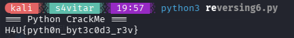

- **Dificultad:** *Medio*
- **Categoria:** *Reversing*
- **Herramientas:** *([pylingual](https://pylingual.io/), python)*

### Descripción 

Un archivo .pyc (compilado de python) que debemos descubrir que hace y aplicar el mismo algoritmo para obtener la flag.

### Obtención del codigo del programa original

Para ello cargue el .pyc en [pylingual](https://pylingual.io/) 

```python

# Decompiled with PyLingual (https://pylingual.io)
# Internal filename: '/tmp/reversing-build/rev6.py'
# Bytecode version: 3.13.0rc3 (3571)
# Source timestamp: 2026-03-24 20:55:00 UTC (1774385700)

def scramble(s):
    out = []
    for i, c in enumerate(s):
        out.append(ord(c) ^ i + 19)
    return out
def check(user_input):
    expected = [99, 109, 97, 126, 39, 118, 70, 120, 98, 104, 46, 125, 47, 68, 18, 125, 81, 23, 83]
    s = scramble(user_input)
    return s == expected and len(user_input) == len(expected)
if __name__ == '__main__':
    print('=== Python CrackMe ===')
    user_key = input('Enter the key: ')
    if check(user_key):
        flag = 'H4U{' + user_key + '}'
        print('Correct! Flag:', flag)
    else:
        print('Wrong key.')

```

Luego de leer el codgio notamos el xor y luego de entender la logica lo modifique para que me diera la flag

```py

def scramble(s):
    out = []
    for i, c in enumerate(s):
        out.append(c ^ i + 19)
    return out
    
def check(user_input):
    expected = [99, 109, 97, 126, 39, 118, 70, 120, 98, 104, 46, 125, 47, 68, 18, 125, 81, 23, 83]
    s = scramble(expected)
    stc  = "".join([chr(x) for x in s])
    print("H4U{" + stc + "}" )
    return s == expected and len(user_input) == len(expected)
if __name__ == '__main__':
    print('=== Python CrackMe ===')
    check("hola")

```

### Ejecutando el python



### Flag

```sh
H4U{pyth0n_byt3c0d3_r3v}
```