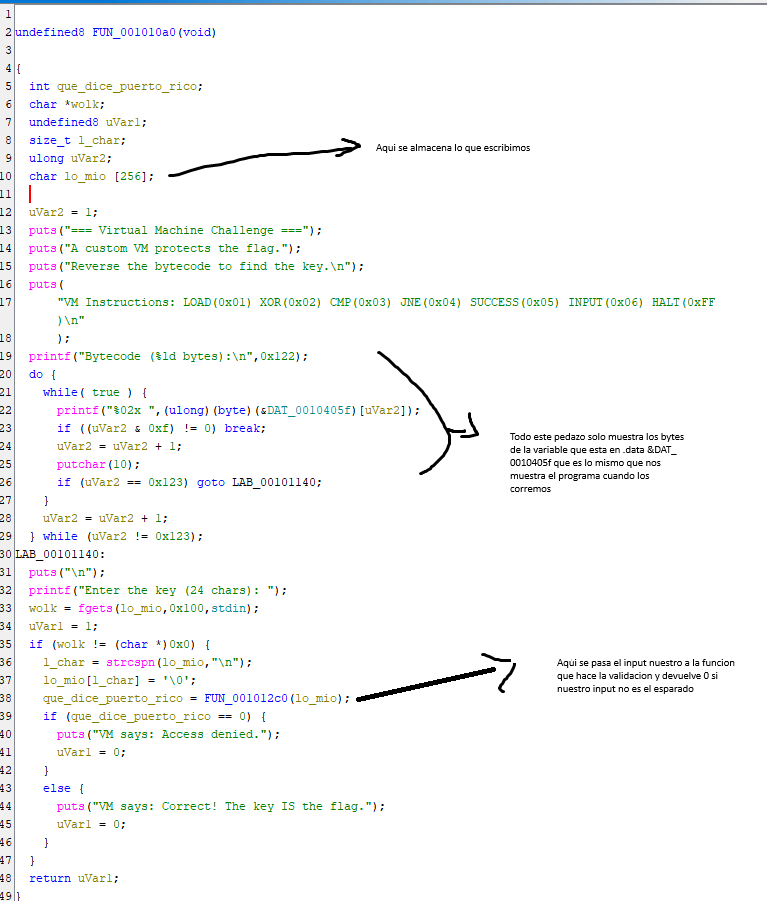
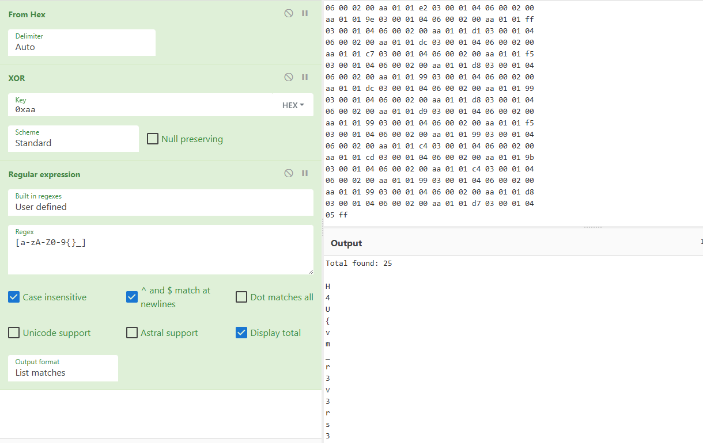
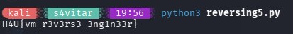

- **Dificultad:** *Difícil*
- **Categoría:** *Reversing*
- **Herramientas:** *(Ghidra, Python)*

### Descripción 

Este binario simula una máquina virtual; tiene sus propias instrucciones. Nuestra tarea es simularla y obtener la flag.

### Análisis general del binario

##### Prueba del programa

```sh id="9q1z7a"
kali  reversing-5  18:47  ./vm_challenge 
=== Virtual Machine Challenge ===
A custom VM protects the flag.
Reverse the bytecode to find the key.

VM Instructions: LOAD(0x01) XOR(0x02) CMP(0x03) JNE(0x04) SUCCESS(0x05) INPUT(0x06) HALT(0xFF)

Bytecode (290 bytes):
06 00 02 00 aa 01 01 e2 03 00 01 04 06 00 02 00 
aa 01 01 9e 03 00 01 04 06 00 02 00 aa 01 01 ff 
03 00 01 04 06 00 02 00 aa 01 01 d1 03 00 01 04 
06 00 02 00 aa 01 01 dc 03 00 01 04 06 00 02 00 
aa 01 01 c7 03 00 01 04 06 00 02 00 aa 01 01 f5 
03 00 01 04 06 00 02 00 aa 01 01 d8 03 00 01 04 
06 00 02 00 aa 01 01 99 03 00 01 04 06 00 02 00 
aa 01 01 dc 03 00 01 04 06 00 02 00 aa 01 01 99 
03 00 01 04 06 00 02 00 aa 01 01 d8 03 00 01 04 
06 00 02 00 aa 01 01 d9 03 00 01 04 06 00 02 00 
aa 01 01 99 03 00 01 04 06 00 02 00 aa 01 01 f5 
03 00 01 04 06 00 02 00 aa 01 01 99 03 00 01 04 
06 00 02 00 aa 01 01 c4 03 00 01 04 06 00 02 00 
aa 01 01 cd 03 00 01 04 06 00 02 00 aa 01 01 9b 
03 00 01 04 06 00 02 00 aa 01 01 c4 03 00 01 04 
06 00 02 00 aa 01 01 99 03 00 01 04 06 00 02 00 
aa 01 01 99 03 00 01 04 06 00 02 00 aa 01 01 d8 
03 00 01 04 06 00 02 00 aa 01 01 d7 03 00 01 04 
05 ff 

Enter the key (24 chars):  
````

Luego de probar el programa, nos damos cuenta de que la flag tiene 24 caracteres (lo dice el mismo programa). Es lo único que vi al inicio (lol). Ahora procedo a desensamblar.

### Ingeniería inversa

Luego de desensamblar, identificamos nuestra función `main` y vemos lo que hace.



Por lo que procedo a desensamblar *FUN_001012c0*. Luego de leer el código de *FUN_001012c0*, cambiar el nombre de las variables para entender mejor y tratar de entender por 30 minutos, lo único que entiendo es que todo ese código valida lo que ingresamos, y no se me ocurre cómo podría obtener la flag de él.

Por lo que me puse a analizar el programa y veo esto:
`VM Instructions: LOAD(0x01) XOR(0x02) CMP(0x03) JNE(0x04) SUCCESS(0x05) INPUT(0x06) HALT(0xFF)`
y pienso... ¿estará aquí la flag?

Y comienzo a analizarlo, y me doy cuenta de las instrucciones como si fuera assembly:

```
06 00         -> lee un carácter y lo guarda en el registro 00
02 00 aa      -> le hace XOR a 00 con la key 0xaa
01 01 e2      -> carga e2 en el registro 01
03 00 01      -> compara que lo que hay en 00 sea igual a lo que hay en 01 
04            -> si no es igual, deja de comprobar los demás caracteres y acaba eso
```

Entonces, viendo los demás bytes, notamos ese patrón de que carga, aplica XOR y compara, por lo que se me ocurre que tal vez aquí está la flag encodeada con XOR, y cada byte que se compara es un carácter de la flag, por lo que se lo aplico en: [Cyberchef](https://cyberchef.io/#recipe=From_Hex%28'Auto'%29XOR%28%7B'option':'Hex','string':'0xaa'%7D,'Standard',false%29Regular_expression%28'User%20defined','%5Ba-zA-Z0-9%7B%7D_%5D',true,true,false,false,false,true,'List%20matches'%29&input=MDYgMDAgMDIgMDAgYWEgMDEgMDEgZTIgMDMgMDAgMDEgMDQgMDYgMDAgMDIgMDAgCmFhIDAxIDAxIDllIDAzIDAwIDAxIDA0IDA2IDAwIDAyIDAwIGFhIDAxIDAxIGZmIAowMyAwMCAwMSAwNCAwNiAwMCAwMiAwMCBhYSAwMSAwMSBkMSAwMyAwMCAwMSAwNCAKMDYgMDAgMDIgMDAgYWEgMDEgMDEgZGMgMDMgMDAgMDEgMDQgMDYgMDAgMDIgMDAgCmFhIDAxIDAxIGM3IDAzIDAwIDAxIDA0IDA2IDAwIDAyIDAwIGFhIDAxIDAxIGY1IAowMyAwMCAwMSAwNCAwNiAwMCAwMiAwMCBhYSAwMSAwMSBkOCAwMyAwMCAwMSAwNCAKMDYgMDAgMDIgMDAgYWEgMDEgMDEgOTkgMDMgMDAgMDEgMDQgMDYgMDAgMDIgMDAgCmFhIDAxIDAxIGRjIDAzIDAwIDAxIDA0IDA2IDAwIDAyIDAwIGFhIDAxIDAxIDk5IAowMyAwMCAwMSAwNCAwNiAwMCAwMiAwMCBhYSAwMSAwMSBkOCAwMyAwMCAwMSAwNCAKMDYgMDAgMDIgMDAgYWEgMDEgMDEgZDkgMDMgMDAgMDEgMDQgMDYgMDAgMDIgMDAgCmFhIDAxIDAxIDk5IDAzIDAwIDAxIDA0IDA2IDAwIDAyIDAwIGFhIDAxIDAxIGY1IAowMyAwMCAwMSAwNCAwNiAwMCAwMiAwMCBhYSAwMSAwMSA5OSAwMyAwMCAwMSAwNCAKMDYgMDAgMDIgMDAgYWEgMDEgMDEgYzQgMDMgMDAgMDEgMDQgMDYgMDAgMDIgMDAgCmFhIDAxIDAxIGNkIDAzIDAwIDAxIDA0IDA2IDAwIDAyIDAwIGFhIDAxIDAxIDliIAowMyAwMCAwMSAwNCAwNiAwMCAwMiAwMCBhYSAwMSAwMSBjNCAwMyAwMCAwMSAwNCAKMDYgMDAgMDIgMDAgYWEgMDEgMDEgOTkgMDMgMDAgMDEgMDQgMDYgMDAgMDIgMDAgCmFhIDAxIDAxIDk5IDAzIDAwIDAxIDA0IDA2IDAwIDAyIDAwIGFhIDAxIDAxIGQ4IAowMyAwMCAwMSAwNCAwNiAwMCAwMiAwMCBhYSAwMSAwMSBkNyAwMyAwMCAwMSAwNCAKMDUgZmY)



YA VEMOS LA FLAG!!!!

Pero me da pereza tener que quitarle los espacios manualmente, así que mejor hago un script en Python para ahorrarme eso (tardé más de lo que hubiera tardado haciéndolo manual).

Primero guardo el hex en un archivo **reversing5variable.txt**, que lo leeré desde Python.

### Código de descifrado

```python id="b3m8qk"
import re

with open("reversing5variable.txt", "r") as f:
    lines = [linea.rstrip('\n') for linea in f.readlines()]
    flag = ""
    vytes = "".join(lines).split(" ")
    for vyte in vytes:
        if not (vyte == "06" or vyte == "01" or vyte == "02" or vyte == "03" or vyte == "04" or vyte == "05" or vyte == "00" or vyte == "aa"):
            xor = int(vyte, 16) ^ 0xaa
            flag += chr(xor)
    print(flag[:-1])
```

Como lo que me interesa es obtener los valores con los `^ 0xaa`, lo que hice fue simplemente obviar las instrucciones, los bytes nulos y el valor de `0xaa` (no usé regex porque no me acordaba cómo hacerlo en Python), y solo se le hizo XOR a los valores que interesan. Al final le quito el último carácter, porque se me cuela un carácter: el de `0xff`, que está al final del hex.



### Flag

```sh
H4U{vm_r3v3rs3_3ng1n33r}
```
