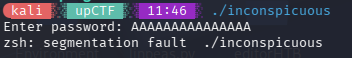
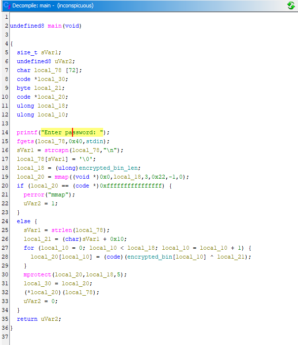
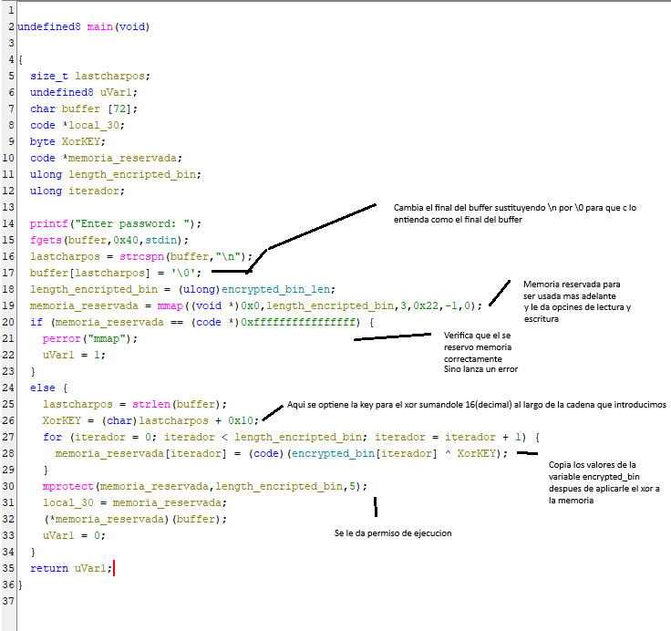
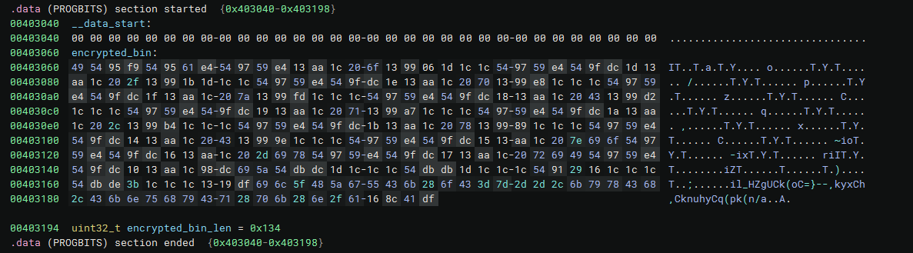
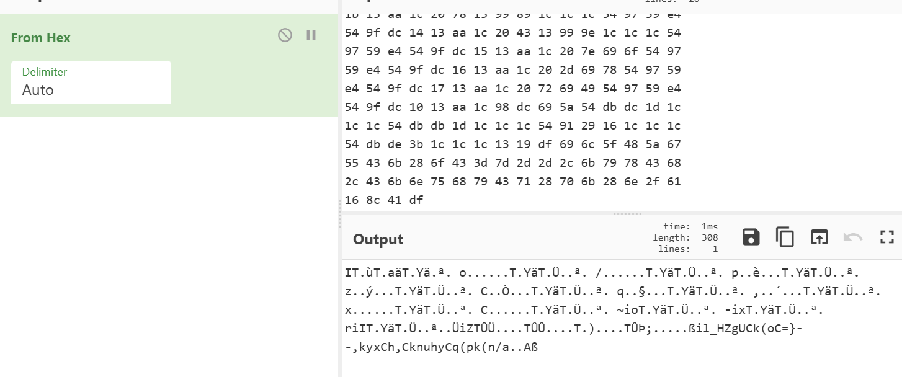
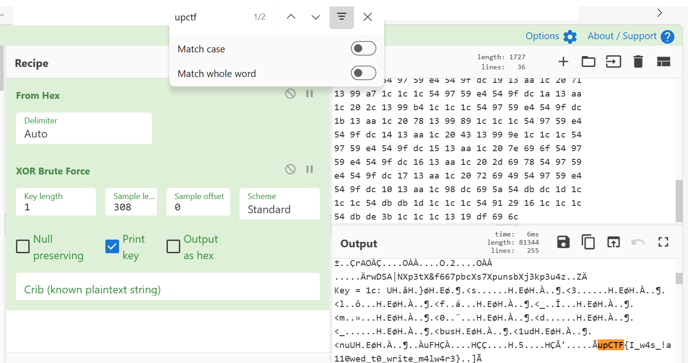

- **Dificultad:** *fácil*
- **Herramientas:** *(ghidra, binary ninja, [cyberchef](https://cyberchef.io/))*

### Descripción 

Este reto pide una contraseña que está cifrada con un algoritmo XOR, nuestra tarea es desensamblar el código para entender el algoritmo y aplicando el mismo XOR obtener la flag.


### Prueba del programa


Al ejecutar el programa nos damos cuenta de que el programa no importa el texto que introduzcamos, siempre dará segmentation fault.

---

### Desensamblado

Luego de desencriptar el programa en Ghidra veremos lo siguiente en la funcion *main*.



Para entender un poco mejor el código, cambiamos los nombres de las variables:



Desde *Binary Ninja* miramos las variables para ver qué contienen (las veo desde Binary Ninja porque se me hace más fácil).



Vemos que la variable ***encrypted_bin_len*** tiene un valor de 0x134 o 308 en decimal que corresponde al tamaño de la variable ***encrypted_bin***.

Lo que nos queda por hacer, teniendo todos los datos necesarios, es aplicar nosotros mismos nuestro ***XOR*** para encontrar lo que realmente hay en ***encrypted_bin***

---

### Descifrando de la flag
Si vemos los bytes de la variable en [cyberchef](https://cyberchef.io/)



Si le aplicamos un xor bruteforce veremos la flag con la ***key: 1c***.



---
### Flag

```bash  

upCTF{I_w4s_!a110wed_t0_write_m4lw4r3} 

```